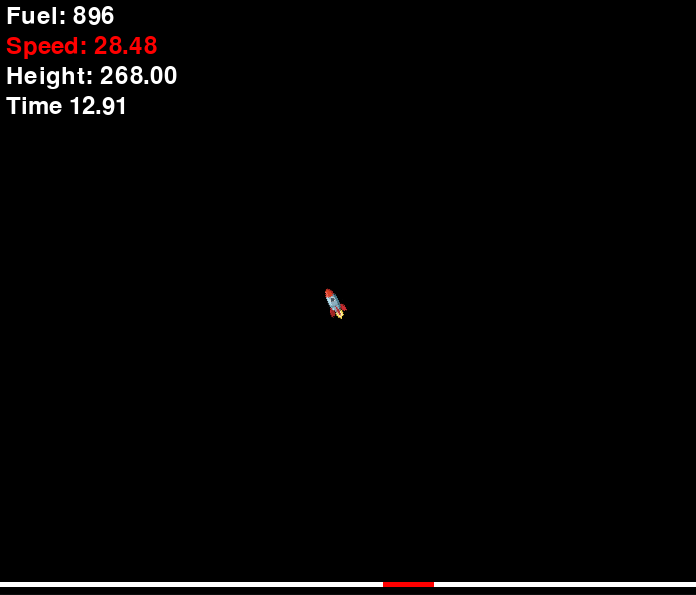

# Spaceship Game

This is a simple spaceship game where you control a spaceship to land on a designated landing site. The game involves controlling the spaceship's thrust and rotation to navigate and land safely on the marked part of the planet surface.

The game has been built in order to test a AI agent that can learn to play the game.



## Setup

### Prerequisites

- Python 3.10
- Pygame library

### Installation of packages

```bash
pip install -r requirements.txt
```

## How to Play

1. **Run the game:**

   ```sh
   python game.py
   ```

2. **Controls:**

   - **Up Arrow:** Apply thrust to move the spaceship upwards.
   - **Left Arrow:** Rotate the spaceship counterclockwise.
   - **Right Arrow:** Rotate the spaceship clockwise.

3. **Objective:**

   - Land the spaceship on the red-marked part of the planet surface.
   - Ensure the speed is below 1 for a successful landing.

4. **End of Game:**
   - If you land on the marked part with a speed below 1, you will see a green "Successful landing!" message.
   - If you land on the marked part with a speed above 1, you will see a red "Crash!" message.
   - If you land outside the marked part, you will see an orange "You missed the landing site!" message.
   - Press the spacebar to restart the game.
   - Press the escape key to exit the game at any time.

## Notes

- The game will display the current fuel, speed, and height of the spaceship on the screen.
- The landing site will be randomly positioned each time you start the game.

## License

This project is licensed under the MIT License.
